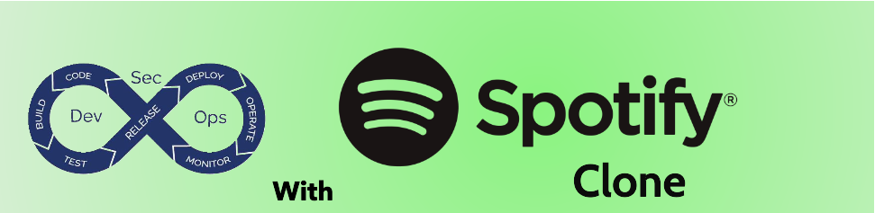

---

# DevSecOps using Spotify-Clone
---

## Project Overview

### Welcome to the Spotify Clone Application! This project is a modern web application that replicates the design patterns and functionality of Spotify. It is built using a robust tech stack that includes React, TypeScript, and Express. This project aims to deploy a functional replica of the Spotify app while emphasizing a DevSecOps approach. By integrating development, security, and operations throughout the application lifecycle, we ensure a robust and secure deployment process.

---

## Key Features:
 * **Modern Tech Stack:** Developed with React for the frontend, leveraging TypeScript for type safety and maintainability, and Express for the backend to handle API requests efficiently.

 * **Containerized Deployment:** Utilizes Docker for containerization, ensuring consistent environments across development, testing, and production.

 * **CI/CD Pipeline:** Implements a full Continuous Integration and Continuous Deployment (CI/CD) pipeline with Jenkins and Docker integration, allowing for automated testing and deployment processes.

* **Secure Development Practices:** Adopts secure coding practices with multistage scanning to identify vulnerabilities early in the development lifecycle.

---

## Pipeline Stages:

---

