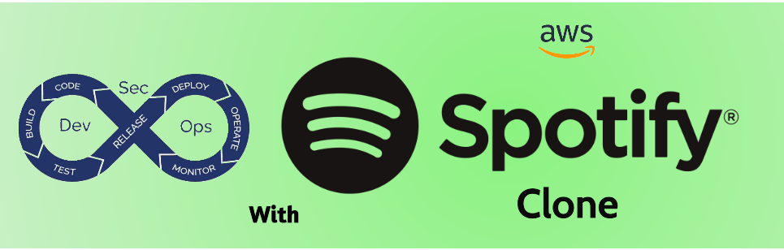
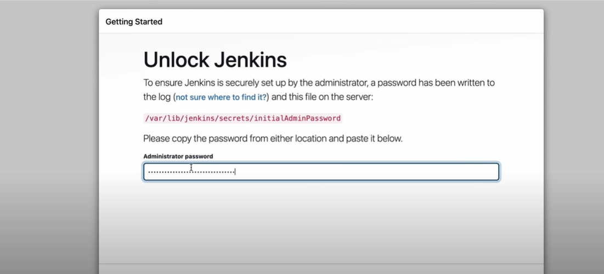
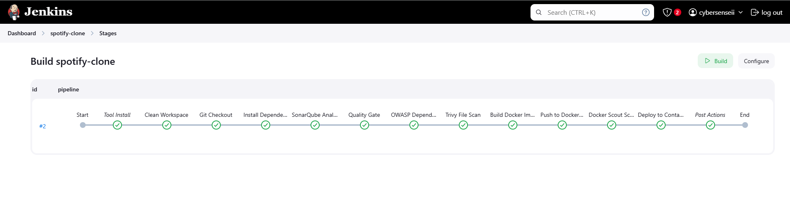

---

# DevSecOps using Spotify-Clone
---

## Project Overview

### Welcome to the DevSecOps using Spotify Clone Application! This project is a modern web application that replicates the design patterns and functionality of Spotify. It is built using a robust tech stack that includes React, TypeScript, and Express. This project aims to deploy a functional replica of the Spotify app while emphasizing a DevSecOps approach. By integrating development, security, and operations throughout the application lifecycle, we ensure a robust and secure deployment process.

---

## Key Features:
 * ### **Modern Tech Stack:** Developed with React for the frontend, leveraging TypeScript for type safety and maintainability, and Express for the backend to handle API requests efficiently.

 * ### **AWS Deployment:** The application is deployed on an AWS instance, specifically using Ubuntu OS and the t2.xlarge instance type, ensuring scalability and performance.

 * ### **Containerized Deployment:** Utilizes Docker for containerization, ensuring consistent environments across development, testing, and production.


 * ### **CI/CD Pipeline:** Implements a full Continuous Integration and Continuous Deployment (CI/CD) pipeline with Jenkins and Docker integration, allowing for automated testing and deployment processes.

* ### **Secure Development Practices:** Adopts secure coding practices with multistage scanning to identify vulnerabilities early in the development lifecycle.

---
## Pre-requisite:
### Before you begin, ensure you have the following accounts and tools set up:

 * **AWS Account:** Required for deploying the application on AWS.

 * **Github Account:** For collaboration on the project.

 * **Dockerhub Account:** Necessary for storing and managing Docker images.

 * **Git Bash Terminal:** If you are using Windows 10/11 to ssh to AWS instance, Git Bash is recommended for executing command-line operations.
---


## Pipeline Stages:


---

## Getting Started:

### To get started with the DevSecops with Spotify Clone Application, clone the repository, install the necessary dependencies, and follow the setup instructions in the documentation.

### Clone Repository:

  Open Gitbash on your systam and follow:

   ```
   mkdir <your-directory-name>

   cd <your-directory-name>

   git clone https://github.com/cybergauravv/DevSecOps-Spotify.git
   ```

## AWS Configuration:

  1. Log in to the AWS Management Console
     
  2. Navigate to EC2 Dashboard
     
  3. Launch a New EC2 Instance
     * This will open the **“Launch an Instance”** wizard.
       
  4. Choose an Amazon Machine Image (AMI)
     * In the ` "Choose an Amazon Machine Image (AMI)" ` step, search for and select an Ubuntu AMI. You can choose the latest version of Ubuntu Server `(e.g., Ubuntu Server 20.04 LTS)`.
       
  5. Choose an Instance Type
     * In the **"Choose an Instance Type"** step, select `t2.xlarge` from the list of instance types.
       
  6. Configure Instance Details
     * Configure the instance settings as needed. You can leave most settings as default for a basic setup.
     * Ensure that you select the appropriate VPC and subnet if necessary.
       
  7. Configure Storage
     * In the **"Configure Storage"** step, you can adjust the storage size to your fit.
       
  8. Create Security Group
     * Create a new security group or select an existing one.
         * Ensure to allow inbound traffic for the following ports:

| Type        | Protocol | Port Range | Source       | Description                     |
|-------------|----------|------------|--------------|---------------------------------|
| SSH         | TCP      | 22         | 0.0.0.0/0    | Allow SSH access                |
| HTTP        | TCP      | 80         | 0.0.0.0/0    | Allow HTTP traffic              |
| Custom TCP  | TCP      | 8080       | 0.0.0.0/0    | Allow traffic on port 8080      |
| Custom TCP  | TCP      | 3000       | 0.0.0.0/0    | Allow traffic on port 3000      |
| Custom TCP  | TCP      | 9000       | 0.0.0.0/0    | Allow traffic on port 9000      |

> ### Note: 
      Jenkins will run on port 8080
      
      SonarQube will run on port 9000
      
      Spotify-Clone will run on port 3000


  * After adding all the required rules, click on the **"Save rules"** button to apply the changes
    
 9. Create a **key pair** login if you do not have existing  and download the .pem file. Choose the key pair to ssh your instance.
     
 10. Launch your instance
     * Wait a few moments for the instance to launch. You will see a confirmation screen with details about your instance.
     * Select your instance, and note the `Public IPv4 address`.
     * Open `Git Bash` on your local machine and use the following command to `SSH` into your instance:

       ```
       cd </path/to/your-key-file.pem>
       
       chmod 400 <your-key-pair.pem>
       
       ssh -i /path/to/your-key-file.pem ubuntu@<your-instance-ip>
       ```
 > #### Replace /path/to/your-key-file.pem with the actual path to your downloaded key file and <your-instance-ip> with the public IP address of your instance.

  * Switch to root user using `sudo su -` 
    

---

## Install Tools & Dependencies:

## Install AWS CLI
```
sudo apt install unzip -y
curl "https://awscli.amazonaws.com/awscli-exe-linux-x86_64.zip" -o "awscliv2.zip"
unzip awscliv2.zip
sudo ./aws/install
```
## Install Jenkins
```
#!/bin/bash
sudo apt update -y
wget -O - https://packages.adoptium.net/artifactory/api/gpg/key/public | sudo tee /etc/apt/keyrings/adoptium.asc
echo "deb [signed-by=/etc/apt/keyrings/adoptium.asc] https://packages.adoptium.net/artifactory/deb $(awk -F= '/^VERSION_CODENAME/{print$2}' /etc/os-release) main" | sudo tee /etc/apt/sources.list.d/adoptium.list
sudo apt update -y
sudo apt install temurin-17-jdk -y
/usr/bin/java --version
curl -fsSL https://pkg.jenkins.io/debian-stable/jenkins.io-2023.key | sudo tee /usr/share/keyrings/jenkins-keyring.asc > /dev/null
echo deb [signed-by=/usr/share/keyrings/jenkins-keyring.asc] https://pkg.jenkins.io/debian-stable binary/ | sudo tee /etc/apt/sources.list.d/jenkins.list > /dev/null
sudo apt-get update -y
sudo apt-get install jenkins -y
sudo systemctl start jenkins
sudo systemctl status jenkins
```
## Install Docker
```
# Add Docker's official GPG key:
sudo apt-get update
sudo apt-get install ca-certificates curl
sudo install -m 0755 -d /etc/apt/keyrings
sudo curl -fsSL https://download.docker.com/linux/ubuntu/gpg -o /etc/apt/keyrings/docker.asc
sudo chmod a+r /etc/apt/keyrings/docker.asc
# Add the repository to Apt sources:
echo \
  "deb [arch=$(dpkg --print-architecture) signed-by=/etc/apt/keyrings/docker.asc] https://download.docker.com/linux/ubuntu \
  $(. /etc/os-release && echo "$VERSION_CODENAME") stable" | \
  sudo tee /etc/apt/sources.list.d/docker.list > /dev/null
sudo apt-get update
sudo apt-get install docker-ce docker-ce-cli containerd.io docker-buildx-plugin docker-compose-plugin -y
sudo usermod -aG docker ubuntu
sudo chmod 777 /var/run/docker.sock
newgrp docker
sudo systemctl status docker
```
## Install Trivy
```
sudo apt-get install wget apt-transport-https gnupg
wget -qO - https://aquasecurity.github.io/trivy-repo/deb/public.key | gpg --dearmor | sudo tee /usr/share/keyrings/trivy.gpg > /dev/null
echo "deb [signed-by=/usr/share/keyrings/trivy.gpg] https://aquasecurity.github.io/trivy-repo/deb generic main" | sudo tee -a /etc/apt/sources.list.d/trivy.list
sudo apt-get update
sudo apt-get install trivy
```
## Install Docker Scout
* #### Login to your dockerhub account:
```
docker login -u <your-dockerhub-username>
Password: <your-dockerhub-password>
```
* #### Run below:
```
curl -sSfL https://raw.githubusercontent.com/docker/scout-cli/main/install.sh | sh -s -- -b /usr/local/bin
```
* #### After successful installations, verify all the tools:
```
aws --version

jenkins --version

docker --version

trivy --version
```
---

## Running SonarQube Community Edition (LTS) in a Docker Container
```
docker run -d --name sonarqube -p 9000:9000 sonarqube:lts-community
```
> ### By executing this command, you are creating and starting a new SonarQube instance in a Docker container, mapping its web interface to your host's port 9000, and running it in the background.

* #### Once the command is successful, you can verify that the SonarQube container is running by executing the following command:
```
docker ps
```
* #### This should indicate below output:
```
CONTAINER ID   IMAGE                    COMMAND                  CREATED          STATUS          PORTS                    NAMES
<container_id> sonarqube:lts-community   "/bin/sh -c 'exec ...'" 10 seconds ago   Up 10 seconds   0.0.0.0:9000->9000/tcp   sonarqube
```
> ### SonarQube sometimes takes a bit on Maintenance page to fully load, Meanwhile let's configure Jenkins.

---

## Jenkins Configuration

### Access Jenkins:
* #### Copy public ip of your AWS instance, open to your browser navigate to URL: `http://<your-instance-IP:8080>`

### Initial Page Setup:
* #### You will be greeted with the "Getting Started" page. This page provides an overview of the setup process.



* #### Open your terminal and run the following command to retrieve the initial admin password:
```
sudo cat /var/lib/jenkins/secrets/initialAdminPassword
```
* #### Copy the password displayed in the terminal and go back to your web browser and paste the copied admin password into the "Administrator password" field on the Jenkins setup page.

* #### Click on the "Continue" button to proceed.

### Install Suggested Plugins:
* #### After unlocking Jenkins, you will be prompted to install plugins. Select the option to "Install suggested plugins" to get the most commonly used plugins.

### Create Admin User:

* #### Once the plugins are installed, you will be prompted to create an admin user. Fill in the required fields such as username, password, full name, and email address.
* #### Click on "Save and Finish" to complete the setup.
  
> #### After completing the setup, you will see a confirmation page indicating that Jenkins is ready to use. Click on "Start using Jenkins" to access the Jenkins dashboard.

## Install Plugins in Jenkins

* #### From the Jenkins dashboard, locate the left-hand sidebar, Click on ` "Manage Jenkins" ` > ` "Plugins" ` > ` "Available Plugins". `
* #### Use the search box to find each of the following plugins one by one:
    * `Eclipse Temurin`
    * `SonarQube Scanner`
    * `NodeJS`.
    * `Docker Common`
    * `Docker API`
    * `Docker Build Step`
    * `Docker Pipeline`
    * `OWASP Dependency-Check`
    * `Email Extension Template`
    * `Blue Ocean`
    * `Pipeline Stage View`

* #### Click ` "Install" ` on the top right hand side of the page.
* #### Once installation is completed, navigate to bottom of the page and click ` "Restart Jenkins" `.
> ### Your Jenkins instance is now equipped with the necessary tools to support your project requirements.
  
## Credentials Setup On Jenkins

### Steps to add credentials in Jenkins under the Credentials section, specifically for `DockerHub` and `Docker Personal Access Token (PAT)`, `SonarQube Token` and `Email-Notifications`.

* #### Click on ` "Manage Jenkins" ` > ` "Credentials". `
* #### Under "Stores scoped to Jenkins," click on the ` "global" ` domain to add global credentials.
* #### Click on ` "Add Credentials". ` (To Add Dockerhub Credentials)

  
  * **Kind:** Select `Username with password.`
  * **Scope:** Leave as `Global (default).`
  * **Username:** Enter your `DockerHub username.`
  * **Password:** Enter your `DockerHub password.`
  * **ID:** Enter `dockerhub-cred.`
  * **Description:** Enter `DockerHub Authentication.`
* #### Click `Create.`

* #### Again, Click on ` "Add Credentials". ` (To Add Docker PAT)

  * **Kind:** Select `Secret Text`
  * **Scope:** Leave as `Global (default).`
  * **ID:** Enter `docker-pat.`
  * **Secret:** Enter your `Personal Access Token`
  * **Description:** Enter `Docker PAT.`
* #### Click `Create.`

* #### We will implement email notifications in Jenkins using a Gmail account, configuring an app password for secure SMTP authentication to notify the status of pipeline results. Follow [Blog](https://medium.com/@soorajswtester/setting-up-app-password-in-gmail-for-jenkins-integration-7fcc780c5a78#:~:text=your%20Google%20Account.-,Navigate%20to%20the%20%E2%80%9CSecurity%E2%80%9D%20section.,e.g.%2C%20%E2%80%9CJenkins%E2%80%9D).
* #### Similarly Create & Add your email credentials with Username and Password. 


> ### Note: We will add Credentials for SonarQube Authentication Token as we progress in this project.

## Configure Tools on Jenkins 

### Steps to Configure Tools in Jenkins:
  * #### Click on ` "Manage Jenkins." ` > ` "Tools" `
  * #### Add Tools based on below Table:

| Tool                       | Name                                                          | Version               | Installation Method                |
|----------------------------|---------------------------------------------------------------|-----------------------|------------------------------------|
| JDK Installation           | JDK17 - Automatic Install - from adoptium.net                | 17.8.1+1              | Automatic Install                  |
| SonarQube Scanner          | SonarQube Scanner                                             | Latest                | Automatic Install                  |
| NodeJS                     | NodeJS 20.x                                                  | 20.9.0                | Automatic Install                  |
| OWASP Dependency-Check     | OWASP-DC                                                     | Latest                | Install from GitHub               |
| Docker                     | Docker                                                       | Latest                | Automatic Install from docker.com  |

  * Click ` "Apply" ` & ` "Save" `

> ### In Jenkins, the "System Configuration" section is where global settings and paths are defined to manage the overall behavior and environment of Jenkins. This configuration will be addressed in detail later in this project, following the completion of the SonarQube configuration setup.

---
## SonarQube Configuration:

### Access SonarQube

  * #### Open your web browser and navigate to your SonarQube instance `http://<your-Instance_IP>:9000`.
  * #### Use the default credentials to log in:
       Username: `admin` ,
       Password: `admin`
  * #### After logging in, you will be prompted to change the default password. Enter a new password and confirm it > Click on ` "Update" ` to save the new credentials.

### Create a New Project:

  * #### Click on the "Projects" tab in the top navigation bar.
  * #### Click on "Create Project" or the "+" icon to start creating a new project.
  * #### In the "Create Project" page, enter the following details:
      **Project Key**: `spotify-clone` ,
      **Project Name**: `Spotify-clone`
  * #### Click ` "Finish" `

### Create a User Token:

  * #### Click on the ` "Administration" ` tab in the top navigation bar.
  * #### Select ` "Security" ` > Locate and click the "User Tokens" section. *(You may find it under the "3 Dots" menu next to the Administrator user)*.
  * #### In the dialog that appears, enter the name for your token:
    * **Token Name:** `sonarqube-token`
  * #### Click on `"Generate"` to create the token.
  * #### Make sure to copy and store the generated token immediately, as it will not be displayed again and will be used for authentication in your CI/CD processes

> ### Go back to `Jenkins` > `Manage Jenkins` > `Credentials` > `Add Credentials` and store generated SonarQube token as `Secret Text` with Name: `sonarqube-token`.

### Configure Webhook in SonarQube:

  * #### Navigate to ` "Administration" ` > ` "Configuration" ` > ` "Webhooks" `
  * #### Click ` "Create" `
  * #### Provide a name for your webhook (e.g., Jenkins Webhook)
  * #### Enter the URL for your Jenkins webhook endpoint. This typically looks like:
    #### `http://<your-Instance-IP>:8080/sonarqube-webhook/`
  * #### Leave `Secret` field empty if you do not want to use a secret.
  * #### Click ` "Create" `
    
---

## System Configuration on Jenkins

### In this part of configuration we will configure "SonarQube Installations" ` and ` "Extended E-mail Notification" ` part.

### SonarQube Installations Configuration:

  * #### Navigate to ` "Manage Jenkins" ` > ` "System" `
  * #### Scroll down to the ` "SonarQube Installations" ` section > Click ` "Add SonarQube" `
  * Enter SonarQube Details:
       * #### Name: `SonarQube`
       * #### URL: `http://<your-Instance-IP>:9000`
       * #### In the ` "Server Authentication Token" ` field, from dropdown select the stored token you created earlier.
       * #### Click ` "Apply" `
   
  > ### This setup allows Jenkins to communicate with SonarQube for project analysis and reporting.

### Extended E-mail Notification Configuration:

  * #### Scroll down to the ` "Extended E-mail Notification" ` section.
  * #### Configure SMTP Server Settings:
       * #### SMTP Server: `smtp.gmail.com`
       * #### SMTP Port: `465`
  * #### Click ` "Advanced" ` option > ` "Credentials" `
       * #### In the "Credentials" dropdown, select the stored mail credentials that you previously added to Jenkins. If you haven't added them yet, you need to create them first (this typically includes your Gmail address and an app password if using 2-Step Verification).
       * Check ` "Use SSL" ` and ` "Use OAuth 2.0" `.
  * #### Set ` "Default Triggers" ` as per your requirement.
  * #### Scroll down to ` "Email Notification" ` section.
  * #### Fill exact same details to test the configuration by sending email. *(In password, paste the password you created on app and not your gmail account password)*
  * #### Click ` "Apply" ` & ` "Save" `.

> ### This setup will allow Jenkins to send email notifications using your Gmail account.

---

## Configure Jenkins Pipeline

  * #### On the Jenkins dashboard, click on  ` "New Item" ` in the left sidebar.
  * #### Enter Item `Name:` `Spotify-clone` and Select option `Pipeline` > Click `OK`
  * #### On Configure section Select `pipeline` and paste below script:

```
pipeline {
agent any

environment {
    DOCKER_IMAGE = 'your-dockerhub-username/spotify-clone'
    DOCKER_TAG = "${BUILD_NUMBER}"
    SONAR_PROJECT_KEY = 'spotify-clone'
    REGISTRY_CREDENTIALS = credentials('dockerhub-cred')
    DEPENDENCY_CHECK_REPORT = 'dependency-check-report.xml'
    SCANNER_HOME = tool 'SonarScanner'
    PATH = "$SCANNER_HOME/bin:$PATH"
}

tools {
    nodejs 'NodeJS 20.x'
}

stages {
    stage("Clean Workspace") {
        steps {
            cleanWs()
        }
    }

    stage('Git Checkout') {
        steps {
            git branch: 'main', url: 'https://github.com/cybergauravv/DevSecOps-Spotify.git'
        }
    }

    stage('Install Dependencies') {
        steps {
            sh 'npm ci --verbose'
        }
    }

    stage('SonarQube Analysis') {
        steps {
            withSonarQubeEnv('SonarQube') {
                sh """
                    sonar-scanner \
                    -Dsonar.projectKey=${SONAR_PROJECT_KEY} \
                    -Dsonar.sources=src \
                    -Dsonar.javascript.lcov.reportPaths=coverage/lcov.info
                """
            }
        }
    }

    stage('Quality Gate') {
        steps {
            timeout(time: 5, unit: 'MINUTES') {
                waitForQualityGate abortPipeline: true
            }
        }
    }

    stage('OWASP Dependency Check') {
        steps {
            dependencyCheck additionalArguments: '''
                --scan ./ 
                --format HTML 
                --format XML 
                --prettyPrint
                --disableYarnAudit
                --disableNodeAudit
                ''',
                odcInstallation: 'OWASP-DC'
            
            dependencyCheckPublisher pattern: DEPENDENCY_CHECK_REPORT
            archiveArtifacts artifacts: DEPENDENCY_CHECK_REPORT, allowEmptyArchive: true
        }
    }

    stage('Trivy File Scan') {
        steps {
            sh "trivy fs . > trivy.txt"
        }    
    }            
 

    stage('Build Docker Image') {
        steps {
            script {
                timeout(time: 5, unit: 'MINUTES') {
                    docker.build("${DOCKER_IMAGE}:${DOCKER_TAG}")
                }
            }
        }
    }

    stage('Push to DockerHub') {
        steps {
            script {
                timeout(time: 5, unit: 'MINUTES') {
                    docker.withRegistry('https://registry.hub.docker.com', 'dockerhub-cred') {
                        def image = docker.image("${DOCKER_IMAGE}:${DOCKER_TAG}")
                        image.push()
                        image.push('latest')
                    }
                }
            }
        }
    }

    stage('Docker Scout Scan') {
       steps {
            timeout(time: 5, unit: 'MINUTES') {
                withCredentials([string(credentialsId: 'docker-pat', variable: 'DOCKER_PAT')]) {
                    sh "echo $DOCKER_PAT | docker login -u cybersenseii --password-stdin"
                    sh """
                       docker-scout quickview ${DOCKER_IMAGE}:${DOCKER_TAG}
                       docker-scout cves ${DOCKER_IMAGE}:${DOCKER_TAG} --only-severity critical,high
                       docker-scout recommendations ${DOCKER_IMAGE}:${DOCKER_TAG}
                    """       
                }    
            }    
        }    
    }    
    
    
    stage('Deploy to Container') {
        steps {
            script {
                timeout(time: 5, unit: 'MINUTES') {
                    try {
                        sh """
                            docker stop spotify-clone || true
                            docker rm spotify-clone || true
                            docker pull ${DOCKER_IMAGE}:${DOCKER_TAG}
                            docker run -d \
                                --name spotify-clone \
                                --restart unless-stopped \
                                -p 3000:3000 \
                                ${DOCKER_IMAGE}:${DOCKER_TAG}
                        """
                    } catch (Exception e) {
                        currentBuild.result = 'FAILURE'
                        error "Deployment failed: ${e.message}"
                    }
                }
            }
        }
    }
}

post {
    always {
        script {
            def sonarqubeUrl = ''
            withSonarQubeEnv('SonarQube') {
                sonarqubeUrl = env.SONAR_HOST_URL
            }
            
            emailext (
                subject: "Pipeline Status: ${currentBuild.result}",
                body: """
                    <html>
                        <body>
                            <h2>Build Status: ${currentBuild.result}</h2>
                            <h3>Build Details:</h3>
                            <ul>
                                <li>Build Number: ${BUILD_NUMBER}</li>
                                <li>Build URL: ${BUILD_URL}</li>
                            </ul>
                            
                            <h3>Security Reports:</h3>
                            <p>Please find the attached security scan reports (if generated).</p>
                            
                            <h3>SonarQube Results:</h3>
                            <p>View the SonarQube analysis results <a href='${sonarqubeUrl}/dashboard?id=${SONAR_PROJECT_KEY}'>here</a>.</p>
                            
                            <h4>Build Logs:</h4>
                            <p>To view the full build logs, please check the build URL provided above.</p>
                        </body>
                    </html>
                """,
                to: 'your-email-here',
                attachmentsPattern: "**/${DEPENDENCY_CHECK_REPORT}, **/trivy.txt",
                mimeType: 'text/html'
            )
        }
        
        cleanWs()
        sh 'docker system prune -f'
    }
    success {
        echo 'Pipeline completed successfully!'
    }
    failure {
        echo 'Pipeline failed!'
    }
}
}
```

  * #### Click ` "Save" ` & ` "Apply" `
  * #### Click `Build Now`

> ### This Jenkins pipeline automates the CI/CD process for the Spotify-Clone application, ensuring code quality, security, and deployment through a series of well-defined stages. This pipeline ensures that the Spotify-Clone application is built, tested for quality and security, and deployed efficiently, with notifications sent to stakeholders after each build.

---

## Monitor running Build

### To monitor a running build in Jenkins, you can utilize the Pipeline Stage View, Pipeline console view and the Console Output features. Jenkins updates the build status to indicate whether the build was successful, unstable, or failed. This status is visible in the build history and on the main job page.


> ### Once build is completed in Jenkins, the system updates the build status, executes defined post-build actions, sends notifications, archives artifacts.


### You will receive an email trigger with the defined reports but if you wish to check your SonarQube Analysis you can check on your SonarQube server under Projects. You can work further on remediation of any triggered vulnerabilities, bugs or code smells.


### Post actions view on Pipeline console


### Successful stages view



---

## Congratulations! Your Spotify-Clone application is now live and ready for you to explore.

###  Accessing Your Application:
  * Open Your Browser and Enter the URL `http://<your-Instance-IP>:3000`
  * Press `Enter` and watch as your ` Spotify-Clone ` application comes to life!


---

## 🎶 Contribute to the Symphony 🎶

We're always looking for talented developers to join our ensemble and help make this Spotify Clone even more harmonious! Whether you're a frontend maestro, a backend virtuoso, or a DevSecOps conductor, there's a place for you in our orchestra.

### 🎵 How to Contribute

1. **Fork the Melody**: Start by forking this repository to your own GitHub account.
2. **Compose Your Changes**: Create a new branch and add your magical musical features.
3. **Tune It Up**: Ensure your code follows our style guide and passes all tests.
4. **Perform a Sound Check**: Test your changes thoroughly.
5. **Submit Your Sonata**: Create a pull request with a clear description of your improvements.

### 🎸 Ideas for Contributions

- Implement new audio features like equalizers or visualizers
- Enhance the user interface with animations and transitions
- Improve accessibility for users with different abilities
- Optimize performance for smoother playback
- Add social features for sharing and collaborating on playlists
- Implement AI-driven music recommendations

Remember, every contribution, no matter how small, adds to the beautiful music we're creating together. Let's make some noise! 🥁🎷🎺

---

<h2 align="center">🎵 Thank You for Exploring Our DevSecOps Spotify-Clone Project! 🎵</h2>

<p align="center">
  
  
  
</p>

<p align="center">
  <strong>🚀 Your journey through our DevSecOps pipeline has been music to our ears! 🎧</strong>
</p>

<p align="center">
  We hope this project has struck a chord with you and amplified your understanding of DevSecOps practices.
</p>

<p align="center">
  <em>Keep the DevSecOps rhythm going and may your code always be in harmony!</em>
</p>

<p align="center">
  <a href="https://github.com/cybergauravv/DevSecOps-Spotify/issues">Report Bug</a> •
  <a href="https://github.com/cybergauravv/DevSecOps-Spotify/issues">Request Feature</a>
</p>

<p align="center">
  <sub>Don't forget to leave a ⭐️ if you found this useful!</sub>
</p>
